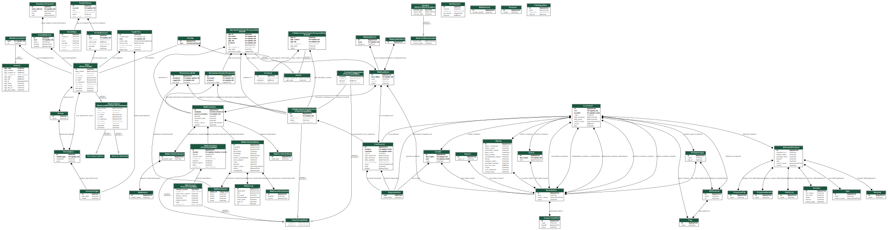

# Architecture

## High Level Overview

The Security tracker consists of a server process that's responsible for
handling HTTP requests and a worker process that's doing all the background
processing.

### External services

The tracker needs to communicate with third party services, namely:

1) The GitHub API for user authentication, team permissions, creating issues, etc
2) Two GitHub repos:
   a) https://github.com/nixos/nixpkgs to pull the latest changes on nixpkgs
   b) https://github.com/CVEProject/cvelistV5 to pull CVE data
3) https://prometheus.nixos.org/ to get information about the latest channels

# Database Schema

