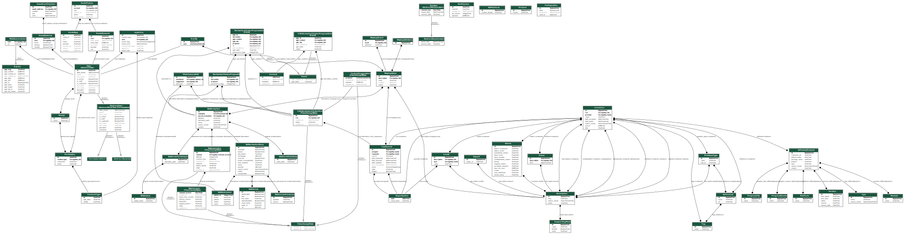

# Architecture

The Security tracker consists of a server process that's responsible for
handling HTTP requests and a worker process that's doing all the background
processing.

# Database Schema

